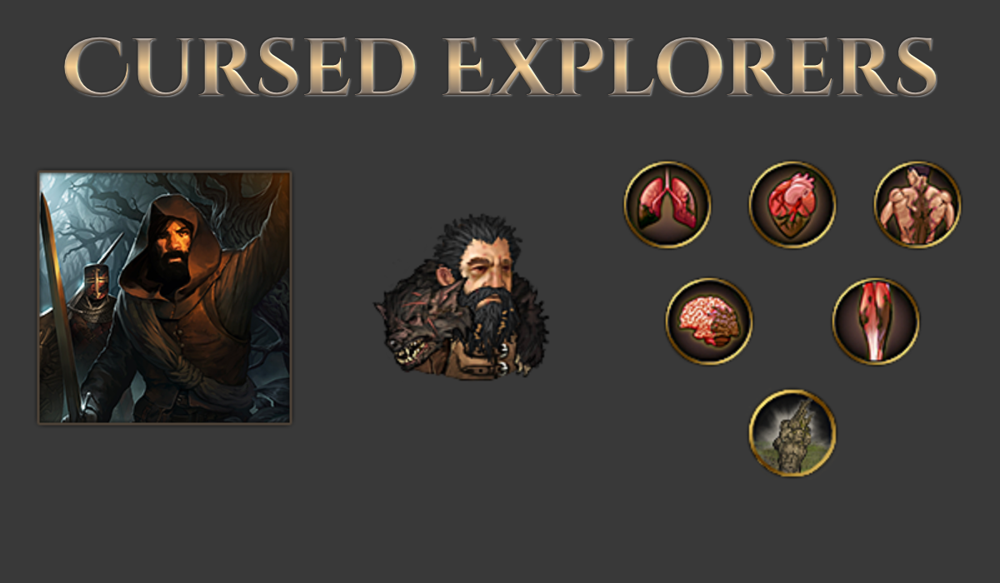

# Of Flesh and Faith+

A mod for the game Battle Brothers ([Steam](https://store.steampowered.com/app/365360/Battle_Brothers/), [GOG](https://www.gog.com/game/battle_brothers), [Developer Site](http://battlebrothersgame.com/buy-battle-brothers/)).

## Additional Reading

- [Mod Background and Design Goals](./mod_background.md)
- [List of new mechanics, abilities, and effects (SPOILERS!)](./mechanics_abilities_effects_spoilers.md)

## Table of contents

-   [Features](#features)
-   [Requirements](#requirements)
-   [Installation](#installation)
-   [Uninstallation](#uninstallation)
-   [Compatibility](#compatibility)
-   [Credits](#credits)

## Features

Of Flesh and Faith+ is a content expansion to the Of Flesh and Faith DLC. It adds:
- Three new origins, one for each of the previous major Battle Brothers DLC
- A total overhaul to the Oathtaker origin with all new effects and mechanics
- 5 new events to expand on the Oathtaker background outside of the origin
- A few smaller additions and events to the Anatomist origin.

### **The Cursed Explorers (Beasts & Exploration)**

The Cursed Explorers are a group of adventurers and vagabonds brought together by a common foe: the Pillager Rot, a degenerative plague that eats away at the body and dulls the senses. Having exhausted mundane cures, they now turn to myth and legend. Can they find the Fountain of Youth before it's too late?

A driven group, the Cursed Explorers gain permanent statboosts every time they explore a legendary location, confident that every myth proven true affirms the existence of the fountain. Additionally, being explorers, they gain experience each time the company discovers a new location and maps out the land.

Dogging the company's heels is the dreaded Pillager Rot. This illness infects your men and grows more debilitating over time, robbing both physical health and combat prowess. And think twice before replacing your sickly veterans - many will risk the Rot for the excitement of mercenary life, but not without demanding greater hiring costs!

### **Old Ironhand's Rune Chosen (Warriors of the North)**

Followers of an esoteric god, the Rune Chosen are a cult of barbarian warriors who seek glorious death in battle. When a worthy warrior falls, it is the duty of his comrades to take his soul and seek victory for them both.

Whenever a member of the Rune Chosen falls in battle, his soul is immortalized in a carved rune - provided he was of great enough experience to warrant such a rite. Depending on his level, his soul produces an accordingly powerful rune. These runes may be given to another member of the company, who will benefit from the boon granted by the rune permanently.

Do not think to cheat death under Old Ironhand's auspices, however - any Rune Chosen that falls in battle will be dead forever, with no chance of merely being struck down with an injury.

### **The Southern Assassins (Blazing Deserts)**

The Southern Assassins are part cold-blooded killer, part Crownling. Seeking out a heretic too powerful for the guilds to touch, they take on contracts as any other sellsword might, but their esoteric training quickly comes through in battle.

At levels 2, 5, and 8, each member of the company gains a random assassin speciality instead of a perk point. These can range from powerful poisons that are inflicted with every blow to whole schools of thought that change how an individual assassin approaches the battlefield.

Providing this training to mercenaries of less exotic backgrounds are two master assassins. They permanently occupy two slots of the company retinue from the outset, limiting options for other camp followers.

### **The Oathtakers**

The Oathtakers origin has been totally overhauled to make their mechanics more engaging and meaningful to character builds.

Where once Oaths were picked for the whole company in lieu of Ambitions, they are now chosen on a per-bro basis via the "Book of Oaths" inventory item. Oaths grant a debuff as the battle brother struggles to internalize its teachings. Once he has completed a quest to prove the oath fulfilled, it instead grants him a buff as consecration of his accomplishment.

Note that Oaths that affect the party as a whole (for instance improving the renown gained per contract) will stack with each other!

Not all the oaths are available from the start of a campaign, however. There are many wardens of the sacred texts, and the company must prove by following the oaths that it has earned the right to access more. Additionally, while the Oathtakers are sworn to follow all of Young Anselm's oaths, there are only so many a man can truly commit to questing toward.

A new Oathtaker campaign will need to be started for these changes to take effect.

### **The Anatomists**

The Anatomists have gotten a small update as well, with a handful of new events and a new potion added for the Conquerer. Seek out the Black Monolith and defeat him for yourself to see what it does!

## Requirements

1) [Modding Script Hooks](https://www.nexusmods.com/battlebrothers/mods/42) (v20 or later)
2) The free [Of Flesh and Faith DLC](http://battlebrothersgame.com/of-flesh-and-faith-release/)
3) The Cursed Explorers require [Beasts & Exploration](http://battlebrothersgame.com/beasts-exploration-release/)
4) The Rune Chosen require [Warriors of the North](http://battlebrothersgame.com/warriors-of-the-north-release/)
5) The Southern Assassins require [Blazing Deserts](http://battlebrothersgame.com/blazing-deserts-release/)

## Installation

1) Download the mod from the [releases page](https://github.com/jcsato/of_flesh_and_faith_plus/releases/latest)
2) Without extracting, put the relevant `of_flesh_and_faith_plus_*.zip` file in your game's data directory
    1) For Steam installations, this is typically: `C:\Program Files (x86)\Steam\steamapps\common\Battle Brothers\data`
    2) For GOG installations, this is typically: `C:\Program Files (x86)\GOG Galaxy\Games\Battle Brothers\data`

## Uninstallation

1) Remove the `of_flesh_and_faith_plus_*.zip` file from your game's data directory

## Compatibility

If playing with the [Legends](https://github.com/Battle-Brothers-Legends/Legends-public) or [Reforged](https://github.com/Battle-Modders/mod-reforged) overhaul mods, make sure to also install the relevant patches from https://github.com/jcsato/bbros_mod_patches.

**IMPORTANT!** As of v2.0, Of Flesh and Faith+ is **NOT** save game compatible. In other words, any saves made while the mod is installed cannot be loaded if the mod is uninstalled.

Versions prior to v2.0 should be safe to remove at any time, provided that only saves not using of the new or modified origins are loaded.

## Credits

### v1.x

**Design and Programming**
- Sato

**Additional Design**
- Luftwaffle
- Calandro

**Artwork**
- Sato
- Von Krolock

**Writing**
- Sato

**Additional Writing**
- Luftwaffle

**Principal Playtesting**
- Doubt
- Gunbuster
- Matrick
- Santo

### v2.x

**Design and Programming**
- Sato

**Artwork**
- Sato
- Von Krolock

**Writing**
- Sato

**Principal Playtesting**
- Doubt
- Orange
- A5G Reaper
