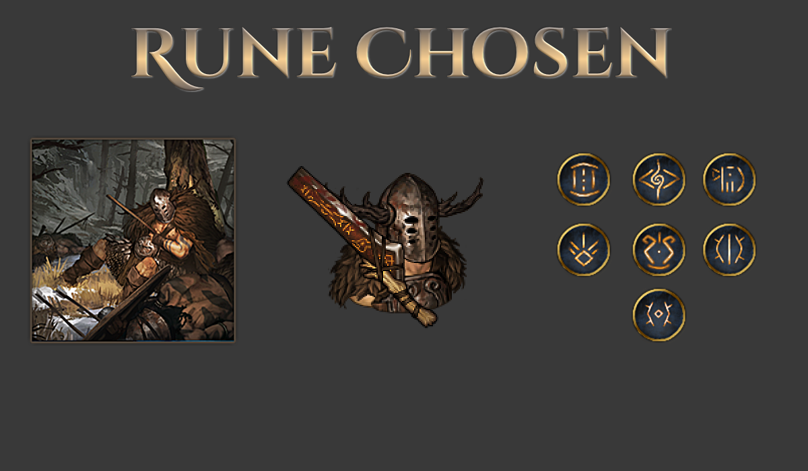
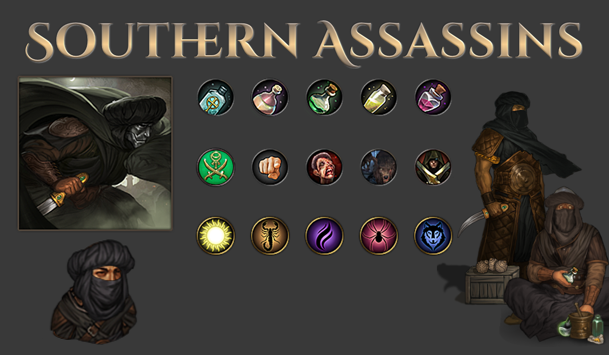
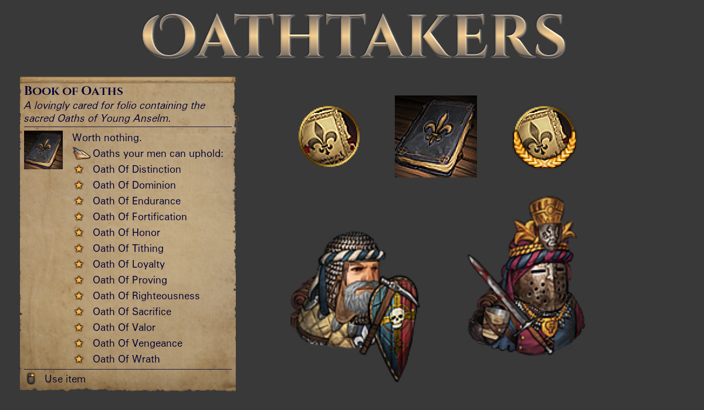

# Of Flesh and Faith+

A mod for the game Battle Brothers ([Steam](https://store.steampowered.com/app/365360/Battle_Brothers/), [GOG](https://www.gog.com/game/battle_brothers), [Developer Site](http://battlebrothersgame.com/buy-battle-brothers/)).

## Table of contents

-   [Features](#features)
-   [Requirements](#requirements)
-   [Installation](#installation)
-   [Uninstallation](#uninstallation)
-   [Compatibility](#compatibility)
-   [Credits](#credits)

## Features

Of Flesh and Faith+ is a content expansion to the Of Flesh and Faith DLC. It adds three new origins, one for each of the previous major Battle Brothers DLC, as well as small additions the Oathtaker and Anatomist origins.

### **The Cursed Explorers (Beasts & Exploration)**

The Cursed Explorers are a group of adventurers and vagabonds brought together by a common foe: the Pillager Rot, a degenerative plague that eats away at the body and dulls the senses. Having exhausted mundane cures, they now turn to myth and legend. Can they find the Fountain of Youth before it's too late?

A driven group, the Cursed Explorers gain permanent statboosts every time they explore a legendary location, confident that every myth proven true affirms the existence of the fountain. Additionally, being explorers, they gain experience each time the company discovers a new location and maps out the land.

Dogging the company's heels is the dreaded Pillager Rot. This illness infects your men and grows more debilitating over time, robbing both physical health and combat prowess. And think twice before replacing your sickly veterans - many will risk the Rot for the excitement of mercenary life, but not without demanding greater hiring costs!

### **Old Ironhand's Rune Chosen (Warriors of the North)**

Followers of an esoteric god, the Rune Chosen are a cult of barbarian warriors who seek glorious death in battle. When a worthy warrior falls, it is the duty of his comrades to take his soul and seek victory for them both.

Whenever a member of the Rune Chosen falls in battle, his soul is immortalized in a carved rune - provided he was of great enough experience to warrant such a rite. Depending on his level, his soul produces an accordingly powerful rune. These runes may be given to another member of the company, who will benefit from the boon granted by the rune permanently.

Do not think to cheat death under Old Ironhand's auspices, however - any Rune Chosen that falls in battle will be dead forever, with no chance of merely being struck down with an injury.

### **The Southern Assassins (Blazing Deserts)**

The Southern Assassins are part cold-blooded killer, part Crownling. Seeking out a heretic too powerful for the guilds to touch, they take on contracts as any other sellsword might, but their esoteric training quickly comes through in battle.

At levels 3, 6, and 9, each member of the company gains a random assassin speciality instead of a perk point. These can range from powerful poisons that are inflicted with every blow to whole schools of thought that change how an individual assassin approaches the battlefield.

Providing this training to mercenaries of less exotic backgrounds are two master assassins. They permanently occupy two slots of the company retinue from the outset, limiting options for other camp followers.

### **The Oathtakers**

The Oathtakers origin has been expanded, with an additional Oath and a new mechanic to incentivize completing their special bonus objectives.

The **Oath of Proving** sees the company commit to martial excellence as individuals. Every man in the company gets a bonus in combat until he fells his first enemy - but those who fail to down any foe by the end of the fight no longer gain any experience until scoring a kill.

Additionally, fulfilling Oath bonus objectives now grants a **unique-per-Oath trait** to all men currently in the company, immortalizing some of the lessons learned while undertaking it.

Lastly, the **Oath of Camaraderie** has been reworked with a new effect and, along with the **Oath of Fortification**, a new bonus objective. The **Oath of Distinction** has had its XP mechanics tweaked under the hood to hopefully better match player expectations.

### **The Anatomists**

The Anatomists have gotten a small update as well, with a new potion added for the Conquerer. You'll have to seek out the Monolith and defeat him for yourself to see what it does!

## Requirements

1) [Modding Script Hooks](https://www.nexusmods.com/battlebrothers/mods/42) (v20 or later)
2) The free [Of Flesh and Faith DLC](http://battlebrothersgame.com/of-flesh-and-faith-release/)
3) The Cursed Explorers require [Beasts & Exploration](http://battlebrothersgame.com/beasts-exploration-release/)
4) The Rune Chosen require [Warriors of the North](http://battlebrothersgame.com/warriors-of-the-north-release/)
5) The Southern Assassins require [Blazing Deserts](http://battlebrothersgame.com/blazing-deserts-release/)

## Installation

1) Download the mod from the [releases page](https://github.com/jcsato/of_flesh_and_faith_plus/releases/latest)
2) Without extracting, put the relevant `of_flesh_and_faith_plus_*.zip` file in your game's data directory
    1) For Steam installations, this is typically: `C:\Program Files (x86)\Steam\steamapps\common\Battle Brothers\data`
    2) For GOG installations, this is typically: `C:\Program Files (x86)\GOG Galaxy\Games\Battle Brothers\data`

## Uninstallation

1) Remove the `of_flesh_and_faith_plus_*.zip` file from your game's data directory

## Compatibility

Of Flesh and Faith+ seeks to be as save game save and compatible as it can be. The mod _should_ be safe to remove at any time, provided the save in question does not use one of the new origins added by the mod or the Of Flesh and Faith DLC itself.

A best-effort attempt will be made to note any save-game incompatible updates to the mod on the releases page.

## Credits

**Design and Programming**
- Sato

**Additional Design**
- Luftwaffle
- Calandro

**Artwork**
- Sato
- Von Krolock

**Writing**
- Sato

**Additional Writing**
- Luftwaffle

**Principal Playtesting**
- Doubt
- Gunbuster
- Matrick
- Santo
